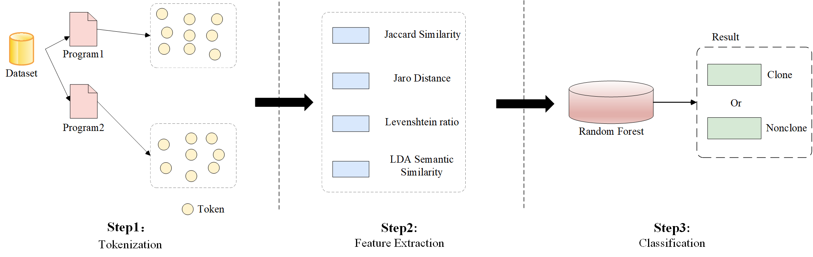

# An Accurate and Efficient Code Clone Detection Approach for Multiple Languages

This repository is the official implementation of [An Accurate and Efficient Code Clone Detection
Approach for Multiple Languages](). The principle is shown in the figure below.
 
## Requirements

To install requirements:

```setup
pip install javalang
pip install Levenshtein
pip install scikit-learn nltk
pip install pygments
pip install pandas
pip install scikit-learn
pip install xgboost
pip install numpy
```

## Tokenization and Feacture Extraction

To run the approach in the paper, run this command firstly:

```
python feacture.py
```

## Train and Eval

To train and evaluate on dataset, run this command:

```
python classify.py 
```

## Results

Our model achieves the following performance on :

### [Code Clone Detection on BigCloneBench](https://github.com/clonebench/BigCloneBench)

| Model name | F1   | Prec. | Recall |             
|------------|------|-------|--------|
| Ours       | 0.86 | 0.89  | 0.84   |

### [Code Clone Detection on POJ-104](https://github.com/microsoft/CodeXGLUE/tree/main/Code-Code/Clone-detection-POJ-104)

| Model name | F1   | Prec. | Recall |             
|------------|------|-------|--------|
| Ours       | 0.75 | 0.79  | 0.71   |

### [Code Clone Detection on Project_CodeNet](https://github.com/IBM/Project_CodeNet)

#### Python
| Model name | F1   | Prec. | Recall |             
|------------|------|-------|--------|
| Ours       | 0.82 | 0.84  | 0.80   |

#### C#
| Model name | F1   | Prec. | Recall |             
|------------|------|-------|--------|
| Ours       | 0.81 | 0.81  | 0.81   |
