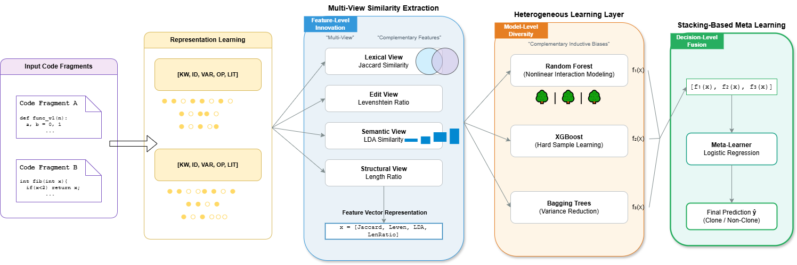

# Learning to Combine Similarities: A Heterogeneous Ensemble Framework for Code Clone Detection

This repository is the official implementation of [Learning to Combine Similarities: A Heterogeneous Ensemble Framework for Code Clone Detection](). The principle is shown in the figure below.
 
## Requirements

To install requirements:

```setup
pip install javalang
pip install Levenshtein
pip install scikit-learn nltk
pip install pygments
pip install pandas
pip install scikit-learn
pip install xgboost
pip install numpy
```

## Tokenization and Feacture Extraction

To run the approach in the paper, run this command firstly:

```
python feacture.py
```

## Train and Eval

To train and evaluate on dataset, run this command:

```
python classify.py 
```

## Results

Our model achieves the following performance on :

### [Code Clone Detection on BigCloneBench](https://github.com/clonebench/BigCloneBench)

| Model name | F1   | Prec. | Recall | Execution Time |         
|------------|------|-------|--------|----------------|
| Ours       | 0.91 | 0.92  | 0.89   | 1,556s         |

### [Code Clone Detection on POJ-104](https://github.com/microsoft/CodeXGLUE/tree/main/Code-Code/Clone-detection-POJ-104)

| Model name | F1   | Prec. | Recall | Execution Time |           
|------------|------|-------|--------|----------------|
| Ours       | 0.76 | 0.77  | 0.74   | 492s           |

### [Code Clone Detection on Project_CodeNet](https://github.com/IBM/Project_CodeNet)

#### Python
| Model name | F1   | Prec. | Recall | Execution Time |       
|------------|------|-------|--------|----------------|
| Ours       | 0.84 | 0.86  | 0.83   | 419s           | 

#### C#
| Model name | F1   | Prec. | Recall | Execution Time |          
|------------|------|-------|--------|----------------|
| Ours       | 0.88 | 0.88  | 0.88   | 452s           |
